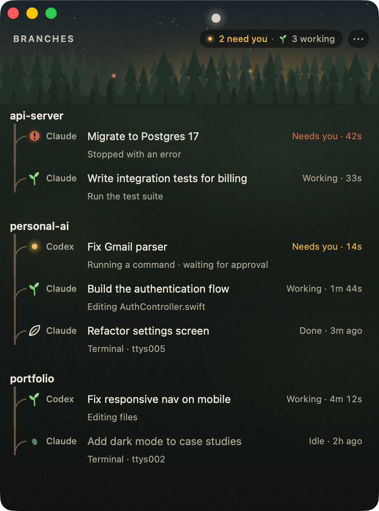
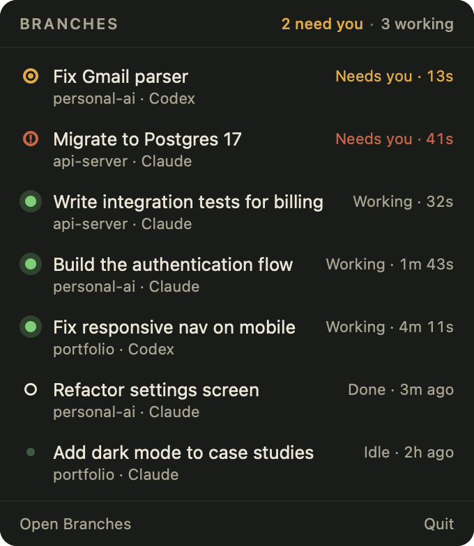

# Branches

**A live activity monitor for your coding agents.**

Branches is a small, free, open-source Mac app that shows every Claude Code and Codex session running on your Mac, what each one is doing, and whether it needs you. Double-click a session to jump straight to its terminal tab.

<p align="center"></p>

It **observes the workflow you already have**. Keep using your terminal, your agent CLI, tmux and your usual launch habits. Branches doesn't launch, prompt or control anything, and it needs no setup.

## Menu bar

Branches also lives in the menu bar. The icon shows a count when something needs you, and clicking it lists every live session. Click one to jump to it. With the menu bar icon on, closing the window keeps Branches watching. You can turn it off in the `⋯` settings.

<p align="center"></p>

## Notifications (optional)

Open `⋯` → *Notify me when a session…* and turn on **Needs me** and/or **Finishes a turn**. macOS asks for permission the first time. Clicking a notification jumps to the session. A "needs you" banner clears itself once the session moves on. Both are off by default.

## Status words

| | Status | Meaning |
|---|---|---|
| ● | **Working** | The agent is doing something right now |
| ◎ | **Needs you** | Waiting for your approval, or stopped with an error |
| ○ | **Done** | Finished a turn you haven't looked at yet |
| · | **Idle** | Alive, and nothing happening |
| – | **Ended** | The process has exited (double-click to copy the resume command) |

Hover over any row to see *why* Branches thinks so (e.g. "Working (reported): provider: busy").

## Install

**From source** (requires Xcode 16+ / Swift 6, macOS 14+):

```bash
git clone https://github.com/mdpierre/branches && cd branches
scripts/bundle.sh
open dist/Branches.app
```

Or run it straight from the source tree with `swift run Branches`. To see it with made-up sessions, run `swift run Branches --demo`.

**Download:** signed releases will be published on GitHub Releases.

## Keyboard

| Key | Action |
|---|---|
| ↑ ↓ | Move selection |
| Return / double-click | Jump to the session |
| Tab | Cycle through sessions that need you |
| ⌘1…⌘9 | Jump to the Nth session that needs you |
| ⌘O | Open the project folder |
| ⇧⌘C | Copy the resume command |
| Type | Filter by project or title; Esc clears |

## Jumping to a session

| Where the agent runs | What happens |
|---|---|
| Terminal.app, iTerm2 | The exact tab comes to the front. The first time, macOS asks whether Branches may control Terminal. |
| Ghostty, Warp, VS Code, Cursor, Obsidian, the Claude and ChatGPT apps | That app comes to the front |
| Ended sessions | `claude --resume …` / `codex resume …` is copied to your clipboard |

## Privacy

> Branches watches your local coding-agent sessions locally and does not send their contents anywhere.

There is no network code, no account, no telemetry, and it never writes to the agents' files. Details are in [PRIVACY.md](PRIVACY.md).

## How it works

- **Claude Code** keeps a small live-status file for each running session (`~/.claude/sessions/<pid>.json`) and a transcript for each session (`~/.claude/projects/…/<id>.jsonl`).
- **Codex** writes a session log (`~/.codex/sessions/YYYY/MM/DD/rollout-*.jsonl`) with explicit turn start and end events.
- Branches watches those folders with FSEvents, reads only the new lines, checks the process table to see which sessions are still alive, and turns all of that into the five status words above.

Several of these files are undocumented, so a Claude Code or Codex update may change them. When that happens, Branches degrades to "no recent activity" instead of crashing, and the settings popover (`⋯`) shows parse diagnostics. Fixes belong in `Sources/BranchesKit/Providers/<Name>/`.

The design docs are in [`docs/`](docs/00-start-here.md).

## Contributing

- `swift build && swift test`
- `swift run Branches --demo` shows sample sessions, handy for UI work. `swift run Branches --screenshot docs/images/screenshot.png --menu-screenshot docs/images/menubar.png` regenerates the README images.
- Read [CLAUDE.md](CLAUDE.md) for the project's hard rules, which apply to humans too.
- To add a provider (Gemini CLI, OpenCode, …), see [Sources/BranchesKit/Providers/README.md](Sources/BranchesKit/Providers/README.md).

## License

MIT
